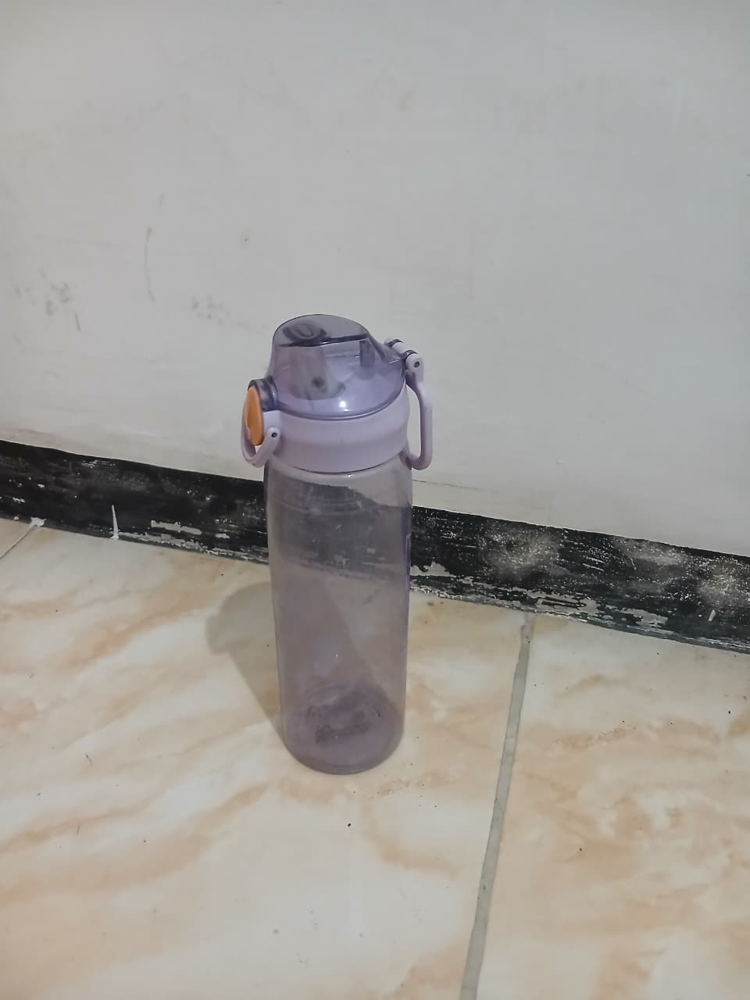
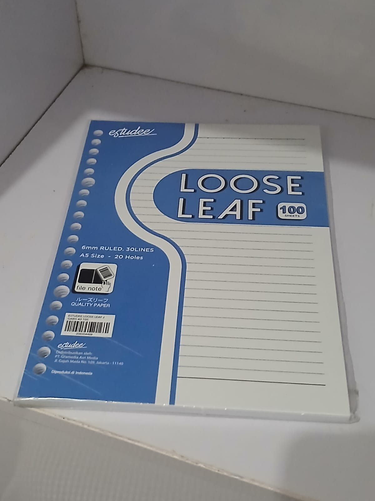
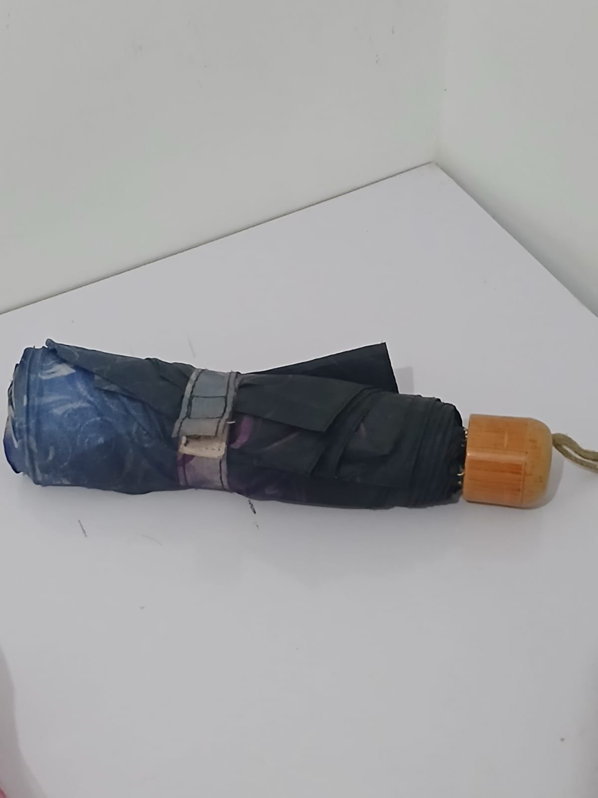

|  | Pemrograman Berorientasi Objek |
|--|--|
| NIM |  254107020022|
| Nama |  Jovita Maharani |
| Kelas | TI - 2F |
| Repository | [link] (https://github.com/jovitamaharani/PBO-JOVITA-2026/blob/main/src/BikeDemo) |

# Jobsheet 01 - Pengantar PBO

## 3.1 Percobaan 1
```
Brand : Trek
Speed : 5
Gear : 2
Brand : Giant
Speed : 5
Gear : 3
PS C:\Java\PBO-JOVITA-2026>   
```

## 3.2 Percobaan 2
```
Brand : Trek
Speed : 5
Gear : 2
Brand : Giant
Speed : 5
Gear : 3
Brand : Specialized
Speed : 5
Gear : 4
Tire Width : 25 mm
Bike Type : Road Bike
PS C:\Java\PBO-JOVITA-2026> 
```

## 5. Pertanyaan
1. Jelaskan perbedaan antara object dengan class!
- object adalah suatu rangkaian dalam program yang terdiri dari state dan behaviour. contoh objek mahasiswa, memiliki nim, memiliki dpa, memiliki matkul, memiliki tugas, bisa masuk perpustakaan dengan ktm
- class adalah blueprint atau prototype dari object. contoh sepatu dan sepatu roda yang dibuat dari bluprint dari sepatu biasa
2. Jelaskan alasan gear dan brand dapat menjadi atribut dari object Bike!
- mereka menjadi atribut karena keduanya merepresentasikan ciri-ciri, keadaan, atau state dari sepeda tersebut, brand menyimpan identitas atau nama pembuat sepeda, gear menyimpan posisi transmisi gigi yang sedang digunakan oleh sepeda
3. Sebutkan salah satu kelebihan utama dari pemrograman berorientasi objek dibandingkan dengan pemrograman prosedural!
- program menjadi lebih fleksibel dan modular. Jika terjadi perubahan atau penambahan fitur, bagian program lain tidak akan mudah terganggu karena data (state) dan perilaku (method) sudah terbungkus rapi di dalam objek.
4. Apakah diperbolehkan melakukan pendefinisian dua buah atribut dalam satu baris kode seperti “public String nama, alamat;”?
- boleh, asal memiliki tipe data yang sama
5. Pada class RoadBike, jelaskan alasan atribut brand, speed, dan gear tidak lagi ditulis di dalam class tersebut! 
- Atribut brand, speed, dan gear tidak lagi ditulis di dalam class RoadBike karena class tersebut menggunakan konsep pewarisan/inheritance dengan mengimplementasikan keyword

## Tugas Praktikum
a.	Foto 4 buah objek di sekitar kalian dengan 2 objek di antaranya merupakan objek yang mengandung konsep pewarisan (inheritance), contoh: kulkas, kursi, meja ruang tamu, meja belajar sehingga diketahui meja ruang tamu dan meja belajar mewarisi objek meja! 
   
b.	Lakukan pengamatan terhadap 4 objek tersebut untuk menentukan atribut dan methodnya!
class wadahair: 
- atribut = bahan, kapasitas liter
- method = setBahan, setKapasitas, cetakInformasi
class ember:
- atribut = warna, adaGagang
- method = setWarna, setAdaGagang, cetakInformasi
class galon 
- atribut = merkAir, isSealed
- method = setMerkAir, pasangSegel, cetakInformasi
class botol
- atribut = warna, adaSedotan
- method = setWarna, setAdaSedotan, cetakInformasi
class tas
- atribut = merk, jumlahKompartemen
- method = setMerk, setJumlahKompartemen, cetakInformasi
c.	Berdasarkan 4 buah objek tersebut, buat class nya dalam Bahasa pemrograman Java! 
```
=== INFO EMBER ===
Bahan          : Plastik PVC
Kapasitas      : 15 Liter
Warna Ember    : Merah
Ada Gagang     : Ya
Tipe           : Ember

=== INFO GALON ===
Bahan          : Polycarbonate
Kapasitas      : 19 Liter
Merk Air       : Aqua
Status Segel   : Tersegel
Tipe           : Galon

=== INFO BOTOL MINUM ===
Bahan          : Stainless Steel
Kapasitas      : 1 Liter
Warna Botol    : Hitam
Ada Sedotan    : Ya
Tipe           : Botol Minum

=== INFO TAS RANSEL ===
Merk Tas       : Eiger
Kompartemen    : 4 kantong
Tipe           : Tas Ransel
PS C:\Java\PBO-JOVITA-2026> 
```
d.	Perlu diperhatikan bahwa terdapat dua class hasil pewarisan sehingga perlu menambah satu class baru sebagai class yang mewarisi dua class tersebut!
```
public class WadahAir {
    private String bahan;
    private int kapasitasLiter;

    public void setBahan(String bahan) {
        this.bahan = bahan;
    }

    public void setKapasitas(int kapasitas) {
        this.kapasitasLiter = kapasitas;
    }

    public void cetakInformasi() {
        System.out.println("Bahan          : " + bahan);
        System.out.println("Kapasitas      : " + kapasitasLiter + " Liter");
    }
}

public class Galon extends WadahAir{}
public class BotolMinum extends WadahAir{}
public class Ember extends WadahAir{}
```
e.	Tambahkan dua atribut untuk setiap class!
class wadahair: 
- atribut = bahan, kapasitas liter
class ember:
- atribut = warna, adaGagang
class galon 
- atribut = merkAir, isSealed
class botol
- atribut = warna, adaSedotan
class tas
- atribut = merk, jumlahKompartemen
f.	Tambahkan tiga method untuk setiap class termasuk method cetak informasi!
class wadahair: 
- method = setBahan, setKapasitas, cetakInformasi
class ember:
- method = setWarna, setAdaGagang, cetakInformasi
class galon 
- method = setMerkAir, pasangSegel, cetakInformasi
class botol
- method = setWarna, setAdaSedotan, cetakInformasi
class tas
- method = setMerk, setJumlahKompartemen, cetakInformasi
g.	Tambahkan satu class Demo sebagai main!
```
public class BarangDemo {
    public static void main(String[] args) {
        Ember emberCuci = new Ember();
        Galon galonAqua = new Galon();
        BotolMinum botolSaya = new BotolMinum();
        TasRansel tasSekolah = new TasRansel();

        emberCuci.setBahan("Plastik PVC");
        emberCuci.setKapasitas(15);
        emberCuci.setWarna("Merah");
        emberCuci.setAdaGagang(true);
        System.out.println("=== INFO EMBER ===");
        emberCuci.cetakInformasi();
        System.out.println();

        galonAqua.setBahan("Polycarbonate");
        galonAqua.setKapasitas(19);
        galonAqua.setMerkAir("Aqua");
        galonAqua.pasangSegel();
        System.out.println("=== INFO GALON ===");
        galonAqua.cetakInformasi();
        System.out.println();

        botolSaya.setBahan("Stainless Steel");
        botolSaya.setKapasitas(1);
        botolSaya.setWarna("Hitam");
        botolSaya.setAdaSedotan(true);
        System.out.println("=== INFO BOTOL MINUM ===");
        botolSaya.cetakInformasi();
        System.out.println();

        tasSekolah.setMerk("Eiger");
        tasSekolah.setJumlahKompartemen(4);
        System.out.println("=== INFO TAS RANSEL ===");
        tasSekolah.cetakInformasi();
    }
}
```
h.	Instansiasikan satu buah objek untuk setiap class!
i.	Terapkan setiap method untuk setiap objek yang dibuat!
j.	Contoh yang telah disebutkan pada poin 1.a tidak diperbolehkan dipakai dalam pengerjaan tugas praktikum ini!
